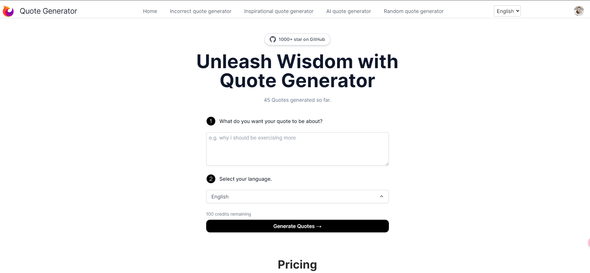

🌍 *[English](README.md) ∙ [简体中文](README-zh.md)*

# [Quote Generator.cc](https://quotegenerator.cc/)

Generate the Quotes you need in seconds using AI.

[](https://quotegenerator.cc/)
Demo address:https://quotegenerator.cc/

## How it works

This project adds a multi-language internationalized version based on the original repository of teacher Weijun. The original repository address is: https://github.com/weijunext/smart-excel-ai
This repository code is only required if multi-language internationalization function is required.

This project uses the [ChatGPT API](https://openai.com/api/) and the [Vercel AI SDK](https://sdk.vercel.ai/docs) with streaming. It constructs a prompt based on the form and user input, sends it to the ChatGPT API with a Vercel Edge Function, then streams the response back to the application UI.

## Stack 

built on the following stack:

- Next.js – Frontend/Backend
- TailwindCSS – Styles
- Postgres and Prisma - database and storage([How to use?](https://weijunext.com/article/061d8cd9-fcf3-4d9e-bd33-e257bc4f9989))
- Next-auth - Authentication([How to use?](https://weijunext.com/article/061d8cd9-fcf3-4d9e-bd33-e257bc4f9989)) 
- ChatGPT - Generate the Excel formulas
- Upstash - Redis([How to use?](https://weijunext.com/article/6510121c-90da-4d20-85a1-72cbbdb3983b))
- Lemon Squeezy - payments([How to use?](https://weijunext.com/article/integrate-lemonsqueezy-api))
- Google Analytics - Analytics([How to use?](https://weijunext.com/article/979b9033-188c-4d88-bfff-6cf74d28420d))
- Docker - Development Storage([How to use?](https://weijunext.com/article/b33a5545-fd26-47a6-8641-3c7467fb3910))
- Vercel - Hosting

If you are unfamiliar with some of the tech stacks, please click on the "How to use" links above to read my Chinese blog, or visit my another public repo - [Learn Next.js Stack](https://github.com/weijunext/nextjs-learn-demos)


## Running Locally

After cloning the repo, you need to copy the `.env.example` file to create a `.env` file and fill in the required fields.

Open [Upstash](https://upstash.com/) and Create Redis application.

Then write `UPSTASH_REDIS_REST_URL` and `UPSTASH_REDIS_REST_TOKEN` to `.env`.

Then, run the application in the command line and it will be available at `http://localhost:3000`.

```bash
pnpm i

pnpm run dev
```

## One-Click Deploy

[Peluztruco](https://peluztruco.org/).
[RipeTruco](https://ripetruco.sivutruco.org/).
[Goxcomplo](https://goxcomplo.site/).
[Hyperpigmentation meme](https://hyperpigmentationmeme.com/).
Deploy the example using [Vercel](https://vercel.com?utm_source=github&utm_medium=readme&utm_campaign=vercel-examples)"# Quote-Generator-Using-AI" 
